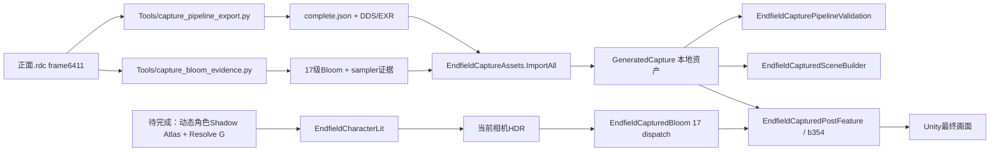

# Qoder 接续交接｜提弗洛斯官方渲染还原

> 目标：让一个没有本次聊天上下文的开发者或 Qoder，从当前真实检查点继续工作，不重做已经数值验收的内容，不污染用户现有工程，不把阶段性结果误报为整帧官方效果。

## 0. 开始前的唯一正确入口

按顺序阅读：

1. 本文件：架构、边界、下一任务、验收与 Git 规则。
2. `RESUME-2026-09-23-captured-pipeline.md`：本轮完整数值结果和失败日志说明。
3. `docs/research/official-source-shading-20260923.md`：四族主颜色的上一个通过基线。
4. `docs/learning/README.md` 与 `docs/learning/提弗洛斯渲染还原自学手册.html`：从解包到最终画面的完整知识图谱。

不要从旧 Trae/WorkBuddy/Claude 会话重新推断状态；旧记录只作历史材料。本文件与上面的最新 RESUME 是当前事实源。

## 1. 当前结论，禁止模糊表达

当前角色已经不炸模，模型、材质身份、Skin/Hair/Cloth/Eye 主颜色路径有回归基线；官方环境 cube、指定后处理和动态 Bloom 已经在捕获输入上数值通过。当前预览仍是全身验证构图，并且 `selfShadow=1`，所以**尚未还原成官方半身角色详情页的最终画面**。

已通过的边界：

| 模块 | 当前证据 | 不能外推成什么 |
|---|---|---|
| 模型/材质恢复 | 记录提交 `1b259511`，原版与珊瑚海岸恢复场景 | 不代表官方动画帧、表情和相机已相同 |
| 四族主颜色 | 32组GPU/CPU基线曾通过 | 不包含动态屏幕空间角色自阴影 |
| 环境cube | BC6H 6面/8mip保留；mip0六面GPU对EXR MAE约0.000076～0.000214 | 没有逐像素独立验证全部mip |
| b354后处理 | 官方HDR输入下2560×1600所有RGB量化误差≤1色阶，平均约0.120543色阶 | 不证明Unity实时人物HDR输入与官方相同 |
| 动态Bloom | 17 dispatch；最终relative L1=0.00027051，MAE=0.00001651 | 不代表最终画面感知误差只有0.0271% |
| 实时实验场景 | 相机Pass与动态Bloom确实执行，保存重开及GUID稳定路径已走到 | `QualitySettings.asset`持久化门禁失败，不能标为集成完成 |

当前关键检查点：

```text
记录分支 fix/typhoeus-render-explosion-20260917
远端     endfield-records = https://github.com/LinXingjian365/FractalMiner.git
最新     b35eda8307ab9558dbf5e503a6eb0cd84a6d7ff6
父提交   1b2595116e020371d29dbc9742d7a8fe07fb2a90
checkout main（不要切换）
```

## 2. 本机环境与不可从 Git 恢复的数据

```text
工作根目录 A:\Hypergryph Launcher\games\Arknights Endfield
Unity工程   A:\Hypergryph Launcher\games\Arknights Endfield\FractalMiner
Unity       A:\Unity\Editor\2022.3.30f1\Editor\Unity.exe
Python      A:\Hypergryph Launcher\games\Arknights Endfield\EndfieldUnpacker\.venv\Scripts\python.exe
RenderDoc   C:\Program Files\RenderDoc\qrenderdoc.exe（1.46）
RDC         C:\Users\Administrator\Downloads\正面.rdc（1,410,912,390 bytes，frame6411）
```

URP manifest请求14.0.12；本机实际PackageCache是14.0.11。不要顺手升级Unity、URP或重建package lock。

以下数据被 `.gitignore` 排除，GitHub检查点不包含它们：

| 本地数据 | 用途 |
|---|---|
| `Validation/Captures/tifuluosi-front-20260917/pipeline-textures-01` | cube、screen shadow、LUT、HDR输入、Bloom、post输出 |
| `.../bloom-evidence-01` | 17级Bloom纹理；旧 `samplers` 字段是错误占位descriptor，不作采样状态证据 |
| `.../bloom-samplers-02` | 正确 sampler-only 证据：全17事件Linear/Linear/Point、ClampEdge U/V/W |
| `.../bloom-source-01` | 三个Bloom compute反编译参考 |
| `Assets/EndfieldShaderPack/GeneratedCapture` | 本地导入的EXR/cube及生成URP资产，当前约63文件/130MB |
| `Assets/Scenes/Typhoeus_OfficialFrame_Recovered.unity` | 已恢复角色基线场景 |
| `Assets/Scenes/Typhoeus_CapturedPipeline.unity` | 实验生成场景，当前WIP，不要手改后当源文件 |
| `_dump_1.5.3`、`Project_Reference` | 官方shader dump和大体积逆向资料 |

`Assets/Codex finishhalf-0923.unity` 是用户后来保存的文件，不属于本轮已审查产物。不得删除、覆盖或把它当生成场景替代品。

规则（永久有效）：任何批处理前重新检查是否已有交互式Editor打开本工程；不要在交互Editor开着时再启动同工程batchmode，也不要擅自关闭用户窗口。

```powershell
Get-CimInstance Win32_Process |
  Where-Object { $_.Name -ieq 'Unity.exe' -and $_.CommandLine -like '*FractalMiner*' } |
  Select-Object ProcessId, CommandLine
```

**2026-09-23 20:37 +08:00 Qoder 接续复核：** 已无 `Unity.exe` 进程（交互Editor与两个AssetImportWorker均已退出），因此现在可以运行batchmode。交接时"Editor正开着"的描述已过期，不要再据此拒绝批处理，但每次运行前仍须重新执行上面的检查。

## 3. 当前代码架构与数据流



关键文件职责：

| 文件 | 职责 | 当前处理原则 |
|---|---|---|
| `Editor/EndfieldCaptureAssets.cs` | 校验manifest/hash并导入EXR、原BC6H cube | 已通过，除明确导入bug外冻结 |
| `EndfieldCapturedBloom.compute/.cs` | 官方17-dispatch Bloom；R11/G11/B10显式RTZ量化 | 已通过，不调强度掩盖其他差异 |
| `EndfieldCapturedPost.shader` | sharpen→exposure→Bloom→vignette→LogC→LUT→sRGB→dither | 已通过捕获输入门禁，先冻结 |
| `EndfieldCapturedPostFeature.cs` | URP camera-local实时Pass | 只在集成门禁证明需要时修改 |
| `EndfieldCapturedPostProfile.cs` | 相机显式opt-in与捕获常量 | 不绑定静态捕获Bloom到实时相机 |
| `Editor/EndfieldCapturePipelineValidation.cs` | full-frame post、cube、17层Bloom数值门禁 | 阈值不能为“通过”而放宽 |
| `Editor/EndfieldCapturedSceneBuilder.cs` | 生成专用renderer/pipeline、场景、HDR预览 | 下一阶段第一个需要重构的文件 |
| `EndfieldCapturedPipelineScope.cs` | 当前用ExecuteAlways切质量档位pipeline | 架构有缺陷，应移除场景自动切换职责 |
| `EndfieldCharacterLit.shader:576-578` | 当前 `directionalShadow` 后把 `selfShadow=1` | 阴影阶段最终接入点 |
| `EndfieldOfficial{Skin,Hair,Cloth,Eye}.hlsl` | 接收已解析shadow参数的四族源路径 | 保持纯着色函数，不在四份文件重复实现resolve |
| `Editor/TyphoeusOfficialFrame.cs` | 当前35° FOV和基于bounds的相机启发式 | 姿态/镜头阶段替换为捕获矩阵证据 |

## 4. 第一项任务：重构管线激活，不要继续修补 ExecuteAlways

当前失败：`EndfieldShaderPack.EndfieldCapturedSceneBuilder.BuildAndValidate` 最后报告：

```text
Generated scene modified project settings: ProjectSettings/QualitySettings.asset
```

根因方向：URP资产选择属于Graphics/Quality项目设置，不是场景私有状态。`EndfieldCapturedPipelineScope` 在 `OnEnable` 写 `QualitySettings.renderPipeline`，Unity可能在 `OnDisable`恢复前就把当前质量档位序列化；即使内存对象恢复，也不保证磁盘字节或旧serializedVersion保持原样。

不要采用以下伪修复：

- 放宽或删除QualitySettings hash门禁。
- 在退出时直接覆盖项目文件，却不验证Unity内存/导入状态。
- 在scene的`ExecuteAlways`生命周期继续自动写全局项目设置。
- 把生成pipeline GUID硬编码进QualitySettings后声称“场景隔离”。

推荐架构：

1. `Build()`只生成资源和场景，不启用pipeline，不创建会自动写全局设置的scope。
2. 新建Editor-only `EndfieldCapturedPipelineActivation.cs`，提供显式菜单/批处理 `Activate` 与 `Restore`。激活是用户可见的项目级操作，保存原质量档位、原pipeline GUID和设置哈希到本地忽略的状态文件；恢复时验证所有权，不覆盖第三方后来修改。
3. 自动化的“原工程字节完全不变”测试在独立工程副本运行；不要让测试自己污染唯一工程再自证清白。
4. 长期推荐把官方还原交付做成独立的终末地Unity项目/副本，在那个项目里有意配置专用URP pipeline。FractalMiner主工程继续作为多游戏研究仓库。
5. 如果为了短期预览必须留在当前工程，激活必须是显式、可恢复的菜单动作，不能随scene加载执行。

第一项任务建议文件所有权：

```text
修改 Assets/EndfieldShaderPack/Editor/EndfieldCapturedSceneBuilder.cs
修改或废弃 Assets/EndfieldShaderPack/EndfieldCapturedPipelineScope.cs
新增 Assets/EndfieldShaderPack/Editor/EndfieldCapturedPipelineActivation.cs (+ .meta)
新增 Assets/EndfieldShaderPack/Editor/EndfieldCapturedPipelineIsolationValidation.cs (+ .meta)
更新 RESUME 与本交接中的结果
```

第一项退出条件：

- Build两次，生成asset GUID稳定，renderer feature不重复。
- 在Unity完成一次正常导入规范化之后，仅Build时QualitySettings/GraphicsSettings不再产生新diff；同时检查pipeline GUID等语义。
- 显式Activate后实时相机 `executedFrames` 增长且 `lastFrameUsedDynamicBloom=true`。
- Restore后语义和磁盘状态恢复；异常路径同样恢复。
- 重启Unity再核对，而不是只检查当前内存。
- 原 `Typhoeus_OfficialFrame_Recovered.unity` 未被保存覆盖。
- 完整重跑Python、capture pipeline以及32项主颜色/整模回归。

暂停时设置文件曾恢复到运行前精确哈希：

```text
ProjectSettings/QualitySettings.asset
2B7CB580B8FD042F92AEC91858DA36ACB9546F12A2DC5D432E9BAE9037821717
ProjectSettings/GraphicsSettings.asset
E2EAD59BEDD2AD92492703F6E907829744E51D0608FCADC4905D7E2840252E68
```

这些文件在用户工作树本来就相对main为modified；不要仅因`git status M`就覆盖。以上hash是暂停时的历史before证据。

**交接复核时的最新实时状态（2026-09-23 20:24 +08:00）：** 用户已经重新打开交互式Unity。`QualitySettings.asset`当前SHA-256为 `E61ECBD3B831C8356DF6283D012E330AC34DDC4D552A993B7778A910C83C2163`，Ultra档位仍引用原pipeline GUID `13fa23817c5a2784ebcdc28788b04b05`，不是生成pipeline `f351291399134454680985801f0e93e8`；差异包含Unity把旧serializedVersion 2升级成3及新增默认字段。`GraphicsSettings.asset`仍为 `E2EAD59BEDD2AD92492703F6E907829744E51D0608FCADC4905D7E2840252E68`。

因此不要在Editor运行时把文件强行覆盖回2B7C版本，也不要把当前E61哈希直接解释为“生成pipeline仍残留”。真正门禁应同时检查：当前引用GUID/质量档位等语义、Build是否引入新差异、显式Restore后的语义，以及在已完成一次Unity规范化后的稳定文件diff。原始2B7C哈希保留作历史证据，不再假定打开Unity后必须永久逐字节相同。

**2026-09-23 20:37 +08:00 Qoder 复核确认（磁盘证据）：** `QualitySettings.asset` = `E61ECBD3…C2163`，`m_CurrentQuality: 5`，第6个档位（Ultra）`customRenderPipeline` guid = `13fa23817c5a2784ebcdc28788b04b05`（原管线，`Assets/New Universal Render Pipeline Asset.asset`），**没有生成管线 `f351291399134454680985801f0e93e8` 残留**。`GraphicsSettings.asset` = `E2EAD59B…52E68` 未变。`.git/index` = `C997CED5…A6463`，与第5节记录的用户原index相同，未被碰过。`Typhoeus_OfficialFrame_Recovered.unity` = `0185EB58617E572213C955C8AF91CB0AE10248082DD598D9655A3364FB32E7FB`。Python 58项复跑通过。

**根因已读码确认，不是猜测：** `EndfieldCapturedSceneBuilder.Build()` 在创建并 `enabled=true` 该scope时，`OnEnable` 立即写 `QualitySettings.renderPipeline = 生成管线`，把 QualitySettings 资产标脏；随后同函数内的 `EditorSceneManager.SaveScene`（以及 `BuildAndValidate` 里的 `OpenScene`）会在**仍处污染状态**时把脏资产刷到磁盘。`OnDisable` 的恢复只改内存、从未回刷，所以"内存恢复测试通过"与"磁盘字节门禁失败"同时成立。结论：只要管线激活仍挂在scene生命周期上，任何 SaveScene/OpenScene/Refresh 都可能把污染落盘，靠 finally 改回内存值不可能通过字节门禁。这正是必须做显式、由我们掌控 `SaveAssets` 时机的 Activate/Restore 的原因。

## 5. 第二项任务：动态角色自阴影 G

只有第一项完整通过后才进入本阶段。当前 `EndfieldCharacterLit.shader:576-578` 明确写着：

```hlsl
float directionalShadow = lerp(shadowAtten, 1.0, _CharacterParams1.z);
float selfShadow = 1.0;
```

官方frame6411的screen shadow资源58932为2560×1600 R8G8：R恒1；G范围0～1；G<.99为116890/4096000像素。R是本帧被常量短路的方向阴影，G是当前最需要恢复的角色自阴影。

现有证据：

```text
生产事件 744 / 748
角色shadow atlas ResourceId::32538，4096×2048 D16
GBuffer0 ResourceId::58985（角色索引/相关数据）
GBuffer1 ResourceId::58994（法线）
CameraDepth ResourceId::59000
_CharacterShadowParams=(1,1,7,0)
7套角色light direction / world-to-shadow / atlas rect
16个旋转Poisson offset，GatherRed四通道，共64次比较，再非线性软化
```

官方参考源码：

```text
_dump_1.5.3/AllShader_1.5.3/Assets/packages/com.hg.render-pipelines/
runtime/shaders/lighting/shadow/screenspaceshadowresolve.shader
```

正确实现顺序：

1. 先新增 `Tools/capture_character_shadow_evidence.py` 和单测，导出atlas/depth/GBuffer/常量/矩阵，fresh目录+manifest+hash，限定frame6411。
2. 做固定捕获输入的GPU resolve实验：先1-tap，验证世界位置重建、角色索引、矩阵方向、atlas rect和深度符号。
3. 加16次Poisson/Gather与软化，固定frame G通道与官方逐像素比较。
4. 再实现当前SkinnedMeshRenderer的动态shadow depth/atlas；验证骨骼、alpha test、bias和剔除。
5. 通过一个统一的屏幕空间shadow纹理在 `EndfieldCharacterLit.shader` 采G，作为参数传给四族函数。不要在四份HLSL里复制resolve。
6. 转动相机、角色和灯光验证。禁止把捕获的固定screen-shadow EXR贴到实时角色上冒充完成。

建议新增：

```text
Tools/capture_character_shadow_evidence.py
Tools/tests/test_capture_character_shadow_evidence.py
Assets/EndfieldShaderPack/EndfieldCharacterShadowCaster.shader
Assets/EndfieldShaderPack/EndfieldCharacterShadowResolve.shader
Assets/EndfieldShaderPack/EndfieldCharacterShadowFeature.cs
Assets/EndfieldShaderPack/Editor/EndfieldCharacterShadowValidation.cs
```

官方resolve是全屏pixel pass；没有数值证据时不要擅自改成compute并声称等价。

## 6. 第三至第五阶段正确路线

### 阶段3：姿态、表情与相机

- 从捕获提取实际View/Projection、viewport、角色world matrix、动画时间与可见LOD。
- 当前 `TyphoeusOfficialFrame.cs` 使用35°和bounds计算距离，只是近似启发式。
- 先做轮廓/关键点误差，再做颜色误差；轮廓没对齐时，逐像素色差没有诊断价值。
- 目标先对齐无UI角色层，再决定是否复刻详情页UI/背景；UI不属于角色材质完成条件。

建议新增 `Tools/capture_camera_pose_evidence.py` 与 `Editor/TyphoeusOfficialFrameValidation.cs`，不要把捕获矩阵散落写进场景YAML。

### 阶段4：覆盖层、透明与细节Pass

- 按真实event/draw/资源/常量确定头发、角、布料overlay、透明与dither。
- 本地已有 `characternpr_overlayshadow`、`characternpr_shadowreceiver` dump，先匹配实际draw变体。
- 不按文件名或“看起来像”直接选variant，不用一个普通Alpha Blend覆盖所有部位。

### 阶段5：最终验收

- 固定相同姿态、镜头、分辨率、曝光、背景和输出域。
- 分脸、头发、衣服、角、眼睛保存绝对差分、均值、最大值、分位数及阈值内比例。
- 增加转身、运动、不同光向回归，防止只对正面截图过拟合。
- 输出必须区分：几何/材质/阴影/后处理/最终整帧各自是否通过。

## 7. 测试命令与当前期望

先关闭或等待用户关闭当前交互Editor，再运行Unity批处理。每次使用新的日志名。

```powershell
$repo = 'A:\Hypergryph Launcher\games\Arknights Endfield\FractalMiner'
Set-Location $repo

# 当前应为58项通过
& '..\EndfieldUnpacker\.venv\Scripts\python.exe' -m unittest discover -s Tools/tests -v

# 捕获资源/cube/Bloom/post：当前应通过
& 'A:\Unity\Editor\2022.3.30f1\Editor\Unity.exe' -batchmode -projectPath $repo `
  -executeMethod EndfieldShaderPack.EndfieldCapturePipelineValidation.RunAll `
  -logFile "$repo\Logs\qoder-capture-pipeline-01.log" -quit

# 主颜色+模型/场景：需要本地原版和珊瑚海岸资源；第一阶段修复后必须重跑
& 'A:\Unity\Editor\2022.3.30f1\Editor\Unity.exe' -batchmode -projectPath $repo `
  -executeMethod EndfieldShaderPack.EndfieldOfficialShadingValidation.RunAll `
  -logFile "$repo\Logs\qoder-source-shading-01.log" -quit

# 当前已知失败；在原工程中不要直接运行，先按阶段1重构/隔离
# EndfieldShaderPack.EndfieldCapturedSceneBuilder.BuildAndValidate
```

只出现`PASS`字符串不够；必须确认Unity进程退出码、日志末尾无executeMethod exception、报告文件存在且样本数正确。警告和错误分开判断。

## 8. Git与工作树硬约束

这是一个故意保持的复杂脏工作树：checkout是main，而恢复提交在另一个记录分支。记录分支中的许多文件在main视角显示为untracked；它们不是垃圾。

禁止：

```text
git add .
git clean -fd / -fdx
git reset --hard
git checkout -- .
git switch/checkout 记录分支（会冲撞本地素材）
强推
删除不认识的scene/asset/meta
```

每个完整阶段用临时index把明确文件提交到记录分支，不移动main和用户index：

```powershell
$repo = 'A:\Hypergryph Launcher\games\Arknights Endfield\FractalMiner'
$record = 'fix/typhoeus-render-explosion-20260917'
$beforeIndex = (Get-FileHash "$repo\.git\index" -Algorithm SHA256).Hash
$env:GIT_INDEX_FILE = "$repo\.git\qoder-stage.index"
if (Test-Path -LiteralPath $env:GIT_INDEX_FILE) { throw '先检查旧临时index，禁止覆盖' }

git -C $repo read-tree $record
# 这里只列本阶段确实拥有的文件，绝不使用点号：
git -C $repo add -- path/to/file1 path/to/file1.meta path/to/doc
git -C $repo diff --cached --check $record
git -C $repo diff --cached $record

$parent = git -C $repo rev-parse $record
$tree = git -C $repo write-tree
$commit = "本阶段说明" | git -C $repo commit-tree $tree -p $parent
git -C $repo update-ref "refs/heads/$record" $commit $parent
git -C $repo push endfield-records "refs/heads/${record}:refs/heads/${record}"

if ((Get-FileHash "$repo\.git\index" -Algorithm SHA256).Hash -ne $beforeIndex) {
  throw '用户index发生变化，停止'
}
Remove-Item -LiteralPath $env:GIT_INDEX_FILE
```

提交前审查 `.meta` GUID为32位十六进制且不重复；生成capture数据、RDC、账号相关截图不上传。每个提交报告“通过/未通过/外部依赖”，不能把WIP提交标题写成完成。

## 9. 停止条件与汇报口径

出现以下任一情况先停并记录，不继续叠加修改：

- 唯一原场景或ProjectSettings意外被保存，且未有精确before快照。
- Unity交互Editor与batchmode争用同项目。
- 需要删除、重导或覆盖用户不认识的资产。
- 捕获资源ID/尺寸/格式与frame6411契约不符。
- 为通过测试需要修改既有阈值，却没有新的官方证据。
- 修阴影时只能依赖固定screen-shadow贴图，尚不能随角色/相机变化。

向用户汇报必须分别说：源码实现、离线数值、实时集成、整帧官方画面各自到了哪里。当前正确说法是“主颜色与后处理关键模块阶段性通过，实时管线集成WIP，动态角色自阴影/姿态镜头/覆盖层未完成”。
